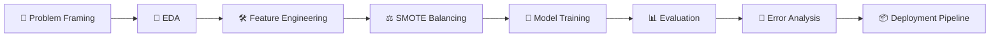

<div align="center">


<br>

[](#)
[](#)
[](#)
[](#)
[](#)

[](#)
[](#)
[](#)
[](#)

</div>

<br>

## 🪧 What's This About?

> Acquiring a new customer costs **5–7x more** than keeping an existing one. This project builds a machine learning system that flags customers who are about to churn — *before* they actually leave — so a telecom company can step in with retention offers and save the relationship.

Built on the classic **Telco Customer Churn dataset** — `7,043 customers` × `21 features` — this repo walks through the full ML lifecycle: EDA → feature engineering → imbalance handling → model battle → deployment-ready pipeline.

<br>

## 📦 What's Inside

<div align="center">

| 📄 File | 📝 Description |
|:---|:---|
| `Customer_Churn_Prediction.ipynb` | 🧪 The full notebook — analysis, modeling, evaluation |
| `WA_Fn-UseC_-Telco-Customer-Churn.csv` | 📊 Raw dataset (7,043 rows) |
| `churn_model.pkl` | 🚀 Final trained pipeline, ready to deploy |

</div>

<br>

## 🛣️ The Journey



<br>

## 🔥 Headline Insights

<table>
<tr>
<td width="50%" valign="top">

### 📉 Who's Leaving?
- **27%** of customers churned — moderately imbalanced
- **Month-to-month** contracts churn the most
- **0–12 months tenure** = highest risk window
- **Higher monthly charges** → higher churn risk

</td>
<td width="50%" valign="top">

### 🛡️ Who Stays?
- **Long-term contracts** = strong retention
- **Add-on services** (Tech Support, Online Security) reduce churn
- **Higher total charges** = longer relationship
- **Auto-pay customers** tend to be more loyal

</td>
</tr>
</table>

<br>

## 🤖 Model Showdown

<div align="center">

| 🏷️ Model | ⚡ Speed | 🎯 Strength | 🔧 Tuned On |
|:---:|:---:|:---|:---:|
| **K-Nearest Neighbors** | 🐢 Slow | Solid baseline, distance-based | `k` (1→15) |
| **Gaussian Naive Bayes** | ⚡ Fastest | Quick & probabilistic | Default params |
| **Support Vector Machine** | 🐌 Slowest | High accuracy, black-box | `C` via CV |
| **Decision Tree** | 🐇 Fast | 🏆 Most interpretable | `max_depth` |

</div>

Every model is scored on **Accuracy, Precision, Recall, F1, and ROC-AUC** — but **Recall is king** here. In churn prediction, a missed churner (false negative) costs the business a customer; a false alarm just costs an unnecessary discount.

A dedicated experiment also pits **SMOTE oversampling** against **`class_weight='balanced'`** head-to-head to see which handles the imbalance better.

<br>

## 🏆 The Winner

The model with the best **Recall** is wrapped in a clean `scikit-learn` `Pipeline`, serialized with `joblib`, and shipped as **`churn_model.pkl`** — ready for instant predictions on new customers.

```python
import joblib

model = joblib.load("churn_model.pkl")

probability = model.predict_proba(new_customer_data)[:, 1]   # churn risk score
prediction  = model.predict(new_customer_data)                # 0 = stay, 1 = churn
```

<br>

## 🧰 Tech Stack

<div align="center">


</div>

<br>

## ⚡ Quick Start

```bash
# 1. Clone the repo
git clone <your-repo-url>
cd customer-churn-prediction

# 2. Install dependencies
pip install pandas numpy matplotlib seaborn scikit-learn imbalanced-learn joblib jupyter

# 3. Fire up the notebook
jupyter notebook Customer_Churn_Prediction.ipynb
```

<br>

## 💼 Why It Matters

Spotting a churner *before* they cancel turns a reactive support team into a proactive retention engine — personalized discounts, loyalty perks, or a well-timed phone call, all powered by a single Recall-optimized model.

<br>

<div align="center">

### ⭐ If this project helped you, consider starring the repo!


</div>
